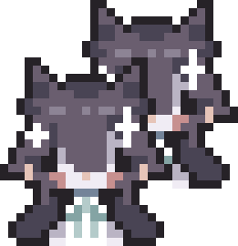

## nophenia-mp

Allows you to play the nophenia game together (˶ᵔ ᵕ ᵔ˶)



## Download

You can download the installer from releases page: https://github.com/BdEgh/nophenia-mp/releases

Check assets for the last available version!

## How-To

### Installing

Download the installer for your system from the [releases page](https://github.com/BdEgh/nophenia-mp/releases)

Extract the archive and run executable:
 * mod_installer.x86_64 for Linux
 * mod_installer.exe for Windows

Select original game folder (may be filled automatically) and the folder where the mod will be installed, then press the install button.

**Notice that the files will be extracted to the specified location. No other folders will be created**

---

### Connecting

In a phone menu, select the "MP Settings" option under "Settings", enter the valid address and switch on the "Connect" button.

**The developer is hosting an instance on the:
```wss://super-cirno.duckdns.org:42424```**

So feel free to use this address to play together!

---

### Self-Hosting

If you want to play privately, you can run your own server

As the host, you need to click the 'Start Server' button in the 'MP Settings' menu

To get an address so that others will be able to join you, you can use the ```ngrok``` service

Create an account and follow the initial setup at https://dashboard.ngrok.com/get-started/setup/ to get an app and store the auth token

Start ngrok using ```ngrok http 42424```, or any other port, if you have changed it in the "MP Settings" menu

Replace https:// with wss:// in the forwarding address and share it with others. For example, ```https://1234-567-890-123-456.ngrok-free.app``` should be changed to ```wss://1234-567-890-123-456.ngrok-free.app```

Have fun!

## Repo

This repo contains both the mod installer and the mod itself